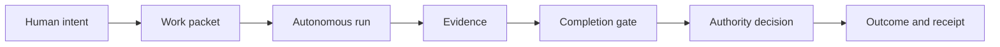

# Software Factory

Software Factory turns explicit human intent and authority into verified outcomes.
Agents may choose how to perform reversible engineering work, but they may act
only within the authority granted to the work and may claim completion only from
recorded evidence.



## Operating boundary

- The human owns product intent and consequential design decisions.
- The factory owns routine, reversible implementation judgment.
- Proof that work is complete does not grant permission to merge or deploy it.
- Unknown, stale, or malformed state blocks consequential actions.
- Every run must end complete, blocked, cancelled, or failed by name.
- Repository code and executable data structures are authoritative.
- Human-facing commands must explain that state in plain language.

## Implemented surface

The first executable slice defines and validates:

- a versioned work packet;
- acceptance criteria with evidence requirements;
- resolved and unresolved decisions;
- an authority envelope with explicit grants and denials;
- a plain-language packet view.

Validate or inspect the included example after installing the package:

```sh
factory packet validate examples/basic-change/packet.json
factory packet show examples/basic-change/packet.json
```

The repository deliberately contains no roadmap or implementation plan. Durable
architectural decisions live in `adr/`; current behavior lives in code, tests,
and executable examples.

## License

Licensed under the [Apache License 2.0](LICENSE).
