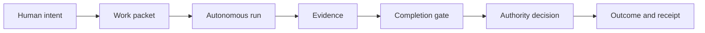

# Software Factory

Software Factory turns explicit human intent and authority into verified outcomes.
Agents may choose how to perform reversible engineering work, but they may act
only within the authority granted to the work and may claim completion only from
recorded evidence.



## Operating boundary

- The human owns product intent and consequential design decisions.
- The factory owns routine, reversible implementation judgment.
- Proof that work is complete does not grant permission to merge or deploy it.
- Unknown, stale, or malformed state blocks consequential actions.
- Every run must end complete, blocked, cancelled, exhausted, or failed by name.
- Repository code and executable data structures are authoritative.
- Human-facing commands must explain that state in plain language.

## Implemented surface

The first executable slice defines and validates:

- a versioned work packet;
- acceptance criteria with evidence requirements;
- resolved and unresolved decisions;
- generic dependency states;
- an authority envelope with explicit grants and denials;
- a computed packet-readiness verdict;
- a durable run bound to an exact work-packet version;
- run state derived from validated transition history;
- plain-language packet, readiness, and run views.

Validate or inspect the included example after installing the package:

```sh
factory packet validate examples/basic-change/packet.json
factory packet show examples/basic-change/packet.json
factory packet readiness examples/basic-change/packet.json
factory packet readiness examples/blocked-change/packet.json
```

Readiness is a read-only packet-definition check. It does not create a run or
perform execution preflight.

| Exit code | Meaning |
|---:|---|
| `0` | The packet is ready to enter run preflight. |
| `1` | The packet is valid but has readiness blockers. |
| `2` | The packet is unreadable or malformed. |

Initialize a durable run without starting execution:

```sh
factory run init examples/basic-change/packet.json ./run.json \
  --initiated-by operator
factory run show ./run.json

# Exits 1 and creates no run record because the packet is blocked.
factory run init examples/blocked-change/packet.json ./blocked-run.json \
  --initiated-by operator
```

Run initialization evaluates readiness again, binds the run to the SHA-256 digest
of the exact packet bytes, and creates only the initial lifecycle transition. It
does not start a worker, perform execution preflight, or grant authority.

| Exit code | `run init` meaning |
|---:|---|
| `0` | The initialized run was persisted. |
| `1` | The packet is valid but blocked; no run was created. |
| `2` | Input is unreadable or malformed. |
| `3` | Persistence did not complete cleanly; the message states whether no run was created or a published record requires inspection. |

Never retry exit `3` blindly. If the message says initialization requires
inspection, examine the named run record first; a complete record may already
exist even though durable publication or temporary cleanup could not be
confirmed.

Run-record destinations are explicit and are never overwritten. The factory does
not yet choose a global run directory or storage backend.

The repository deliberately contains no roadmap or implementation plan. Durable
architectural decisions live in `adr/`; current behavior lives in code, tests,
and executable examples.

## Participate

- Use [Discussions](https://github.com/dweeb11/software_factory/discussions) for
  early ideas and architecture questions.
- Report incorrect existing behavior with the bug-report Issue Form.
- Use the work-packet Issue Form for concrete, bounded changes with checkable
  outcomes.

Issue content can propose intent and evidence requirements, but it cannot grant
an agent authority to push, merge, deploy, or perform another consequential
action. Authority is recorded separately by a trusted maintainer.

## License

Licensed under the [Apache License 2.0](LICENSE).
