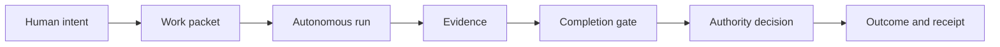

# Software Factory

Software Factory turns explicit human intent and authority into verified outcomes.
Agents may choose how to perform reversible engineering work, but they may act
only within the authority granted to the work and may claim completion only from
recorded evidence.



## Operating boundary

- The human owns product intent and consequential design decisions.
- The factory owns routine, reversible implementation judgment.
- Proof that work is complete does not grant permission to merge or deploy it.
- Unknown, stale, or malformed state blocks consequential actions.
- Every run must end complete, blocked, cancelled, exhausted, or failed by name.
- Repository code and executable data structures are authoritative.
- Human-facing commands must explain that state in plain language.

## Implemented surface

The first executable slice defines and validates:

- a versioned work packet;
- acceptance criteria with evidence requirements;
- resolved and unresolved decisions;
- generic dependency states;
- an authority envelope with explicit grants and denials;
- a computed packet-readiness verdict;
- a durable run bound to an exact work-packet version;
- run state derived from validated transition history;
- a versioned execution-environment snapshot with observation provenance;
- deterministic execution preflight over current run, packet, and environment facts;
- exclusive controller claims with append-only transfer and recovery receipts;
- one canonical mutable publication for each initialized run;
- immutable activation attempts and worker-ready observations;
- an atomic, exactly bound `initialized` to `active` handoff commit;
- plain-language packet, readiness, run, preflight, ownership, and activation views.

Validate or inspect the included example after installing the package:

```sh
factory packet validate examples/basic-change/packet.json
factory packet show examples/basic-change/packet.json
factory packet readiness examples/basic-change/packet.json
factory packet readiness examples/blocked-change/packet.json
```

Readiness is a read-only packet-definition check. It does not create a run or
perform execution preflight.

| Exit code | Meaning |
|---:|---|
| `0` | The packet is ready to enter run preflight. |
| `1` | The packet is valid but has readiness blockers. |
| `2` | The packet is unreadable or malformed. |

Initialize a durable run without starting execution:

```sh
factory run init examples/basic-change/packet.json ./run.json \
  --initiated-by operator
factory run show ./run.json

# Exits 1 and creates no run record because the packet is blocked.
factory run init examples/blocked-change/packet.json ./blocked-run.json \
  --initiated-by operator
```

Run initialization evaluates readiness again, binds the run to the SHA-256 digest
of the exact packet bytes, and creates only the initial lifecycle transition. It
does not start a worker, perform execution preflight, or grant authority.

| Exit code | `run init` meaning |
|---:|---|
| `0` | The initialized run was persisted. |
| `1` | The packet is valid but blocked; no run was created. |
| `2` | Input is unreadable or malformed. |
| `3` | Persistence did not complete cleanly; the message states whether no run was created or a published record requires inspection. |

Never retry exit `3` blindly. If the message says initialization requires
inspection, examine the named run record first; a complete record may already
exist even though durable publication or temporary cleanup could not be
confirmed.

Run-record destinations are explicit and are never overwritten. The run stays at
that caller-selected canonical entry. Account-scoped coordination metadata records
which exact entry owns lifecycle mutation; it is not a second run-state store.

Evaluate collected execution facts without acquiring ownership or starting a
worker:

```sh
factory run preflight \
  examples/initialized-run/run.json \
  examples/basic-change/packet.json \
  examples/preflight-ready/environment.json

factory run preflight \
  examples/initialized-run/run.json \
  examples/basic-change/packet.json \
  examples/preflight-blocked/environment.json
```

The checked-in environment snapshots use fixed timestamps so tests can pin the
evaluation time. At another wall-clock time they correctly block as stale; a real
collector must generate a fresh snapshot.

Collectors may be deterministic probes, adapters, inspection agents, or humans.
They report observations and provenance; they do not decide the verdict. The
preflight evaluator deterministically checks freshness, packet identity and
readiness, run state, controller availability, workspace isolation, execution
capabilities, verification routes, requested worker actions, and authority state.

| Exit code | `run preflight` meaning |
|---:|---|
| `0` | Current collected facts pass execution preflight. |
| `1` | Inputs are valid, but every current blocker is reported. |
| `2` | A run, packet, snapshot, or evaluation parameter is unreadable or malformed. |

A passing verdict is not an activation token. Preflight acquires no controller
ownership, records no transition, starts no worker, and performs no external
action. Mutable facts must be checked again during guarded activation.

Acquire exclusive controller ownership for an initialized run:

```sh
factory run claim acquire \
  ./run.json \
  --controller-id controller-1 \
  --recorded-by operator

factory run claim show ./run.json
```

The CLI uses one coordination namespace at
`<OS account home>/.software-factory/controller-claims`, anchored to the operating
system account rather than the mutable `HOME` environment. It derives the claim
directory from the immutable run ID; callers cannot select competing locations.
Moving, renaming, or hard-linking the run record therefore does not create another
claim location. The directory contains immutable, ordered JSON events. Initial
acquisition creates it exclusively and never overwrites an existing claim. Current
ownership is derived from the final validated event rather than a competing
current-owner field.

A planned handoff or explicit crash recovery must name the exact current claim:

```sh
factory run claim transfer ./run.json \
  --expected-claim-id CLAIM-CURRENT \
  --controller-id controller-2 \
  --reason "planned handoff" \
  --recorded-by operator

factory run claim recover ./run.json \
  --expected-claim-id CLAIM-CURRENT \
  --controller-id controller-3 \
  --reason "prior controller process exited" \
  --recorded-by operator
```

Each successful change publishes the next receipt. Competing changes target the
same next sequence, so only one can win. A claim never expires automatically:
age may prompt inspection, but age alone cannot authorize takeover.

| Exit code | `run claim` meaning |
|---:|---|
| `0` | The claim was acquired or changed, or a valid claim was shown. |
| `1` | Ownership contention or a stale expected claim blocked the requested change. |
| `2` | The run or claim is unreadable, malformed, ambiguous, or incomplete. |
| `3` | Persistence did not complete cleanly; inspect the named claim before retrying. |

A controller claim grants exclusive coordination ownership only. It does not grant
authority to edit, commit, push, merge, deploy, or start a worker. This file-backed
implementation requires a resolvable POSIX account-database entry and coordinates
controllers running under that same local operating-system account. It fails closed
rather than falling back to an environment-selected namespace. Multi-user and
distributed coordination require a shared supervisor and are not claimed here.

Guard activation of a claimed initialized run in three durable steps:

```sh
factory run activation attempt \
  ./run.json \
  examples/basic-change/packet.json \
  ./owned-environment.json \
  --expected-claim-id CLAIM-CURRENT \
  --recorded-by controller-1

factory run activation worker-ready \
  ./run.json ACTIVATION-ID \
  --expected-claim-id CLAIM-CURRENT \
  --worker-id WORKER-ID \
  --workspace-id WORKSPACE-ID \
  --recorded-by controller-1

factory run activation commit \
  ./run.json \
  examples/basic-change/packet.json \
  ACTIVATION-ID \
  --expected-claim-id CLAIM-CURRENT

factory run activation show ./run.json ACTIVATION-ID
```

The activation environment uses schema version `2` and must report the exact
current controller with state `owned`. Attempt creation re-reads the canonical run,
claim, packet, and environment, recomputes preflight in owned-controller mode, and
publishes nothing when blocked. The worker-ready command records the current
controller's durable observation that an adapter prepared the named worker idle in
the bound workspace. It does not independently prove readiness or prepare, start,
or prompt a worker by itself.

Commit checks the same publication, claim, packet, attempt, ready observation, and
preflight freshness before atomically replacing the canonical run. Copies,
symbolic links, hard links, renamed entries, substituted initialized bytes, stale
claims, and mismatched workers or workspaces block. Exact retries reconfirm
run-record durability; conflicting retries do not overwrite state.

| Exit code | `run activation` meaning |
|---:|---|
| `0` | The requested record or exact activation commit is durable, or valid activation state was shown. |
| `1` | Current valid state blocks the request, or another immutable publication won contention. |
| `2` | An input or durable record is unreadable, malformed, ambiguous, or inconsistent. |
| `3` | Publication may be visible but durability is uncertain; inspect before retrying. |

`active` means only that the guarded idle-worker handoff was committed. It is not
completion, acceptance, merge readiness, or external authority. This slice does
not launch an ACP session or tell the prepared worker to begin; worker transport is
the next adapter boundary.

The repository deliberately contains no roadmap or implementation plan. Durable
architectural decisions live in `adr/`; current behavior lives in code, tests,
and executable examples.

## Participate

- Use [Discussions](https://github.com/dweeb11/software_factory/discussions) for
  early ideas and architecture questions.
- Report incorrect existing behavior with the bug-report Issue Form.
- Use the work-packet Issue Form for concrete, bounded changes with checkable
  outcomes.

Issue content can propose intent and evidence requirements, but it cannot grant
an agent authority to push, merge, deploy, or perform another consequential
action. Authority is recorded separately by a trusted maintainer.

## License

Licensed under the [Apache License 2.0](LICENSE).
